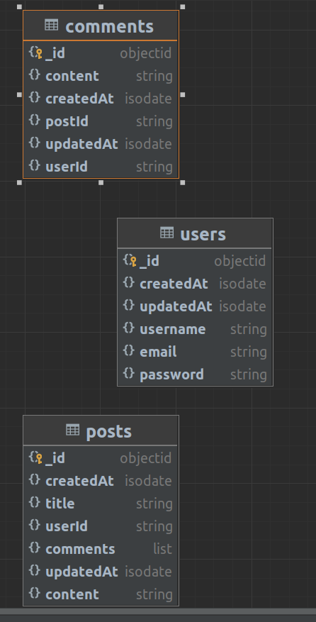

# Table of Contents
- [Introduction](#introduction)
- [Structure](#structure)
- [Instructions](#instructions)
- [Database Captures](#database-captures)
- [Database Structure](#database-structure)
- [Database Captures](#database-captures)
- [Execution](#execution)
- [Bibliography](#bibliography)

# Introduction

This modest project is developed using PHP 8.2, enabling the author to review and demonstrate their knowledge of PHP and MongoDB. It is not meant to serve as a guide or a manual for best practices.

The project is designed to include an implementation of a MongoDB database utilizing raw PHP and composer.

Additionally, this project is a component of a PHP roadmap, which is in turn part of a series of such roadmaps. The PHP Roadmap can be accessed at the following URL:
- [Father](https://github.com/alexbonavila/PhpRoadmap)

# Structure

This is a simple project where the communication system with mongo and object mapping in src has been implemented and where all the code is executed, including the demonstrations in bootstrap.php.

# Instructions

To run the project create a .env from .env.example, and run the following command:

`$ php bootstrap.php`

# Database Captures

# Database Structure

# Execution

To simplify the execution demonstration, only the beginning and end of the execution are introduced.

# Bibliography
- https://www.mongodb.com/
- https://www.w3schools.com/mongodb/
- https://www.mongodb.com/docs/drivers/php-drivers/
- https://www.php.net/manual/en/set.mongodb.php
- https://www.mongodb.com/docs/manual/data-modeling/