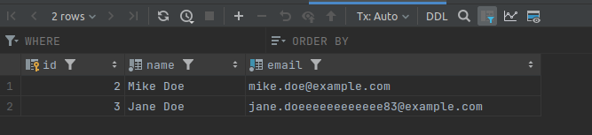
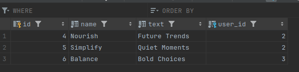
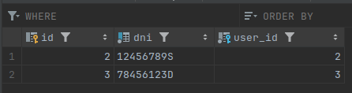

# Table of Contents
- [Introduction](#introduction)
- [Structure](#structure)
- [Design](#design)
- [Database Captures](#database-captures)
- [Database Structure](#database-structure)
- [Execution](#execution)
- [Bibliography](#bibliography)

# Introduction
This modest project is developed in PHP 8.2, allowing the author to review and attest to his knowledge of PDO. It is not intended to serve as a guide or manual of best practices.

The idea is that this project contains an implementation of a DB, using PDO, and then in a hardcoded index.php it simply demonstrates that this implementation works.

This project is a component of a PHP roadmap, which is itself part of a series of roadmaps. The PHP RoadMap can be found at the following URL:
- [Father](https://github.com/alexbonavila/PhpRoadmap)

# Structure

This project is designed to work through an action directory that implements a CRUD and the database setup. 

And an Objects directory that maps the objects of the DB serving as a Model.

Lastly, the project includes a 'index.php' file which controls the execution.

# Instructions

The next command executes the code in "index.php" and runs a predefined instructions:

`$ php index.php`

# Database Captures

User Table

Post Table

Document Table

# Database Structure

# Execution

# Bibliography
- https://www.mssqltips.com/sqlservertip/2380/sql-server-database-design-with-a-one-to-one-relationship/