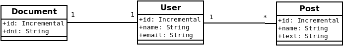
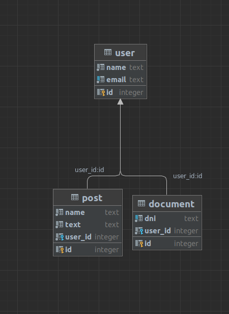
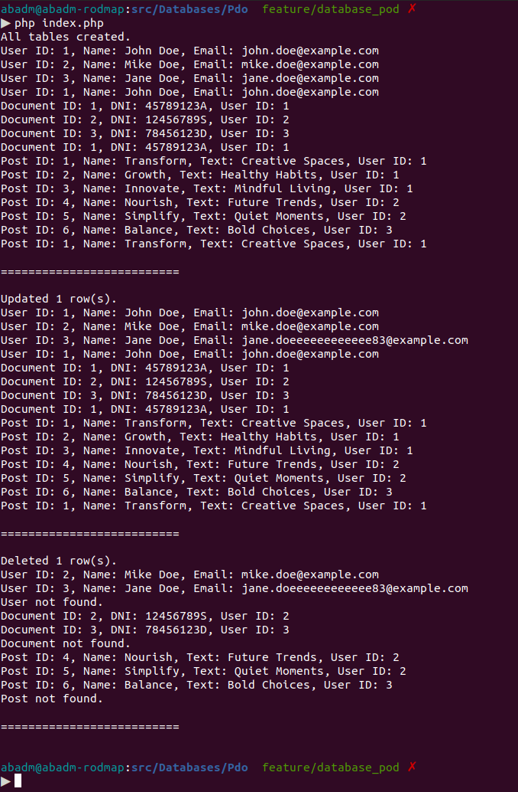

# Table of Contents
- [Introduction](#introduction)
- [Design](#design)
- [Execution](#execution)
- [Bibliography](#bibliography)

# Introduction
This modest project is developed in PHP 8.2, allowing the author to review and attest to his knowledge of PDO. It is not intended to serve as a guide or manual of best practices.

The idea is that this project contains an implementation of a DDBB, using PDO, and then in a hardcoded index.php it simply demonstrates that this implementation works.

This project is a component of a PHP roadmap, which is itself part of a series of roadmaps. The PHP RoadMap can be found at the following URL:
- [Father](https://github.com/alexbonavila/PhpRoadmap)

# Design

# Execution

# Bibliography
- https://www.mssqltips.com/sqlservertip/2380/sql-server-database-design-with-a-one-to-one-relationship/