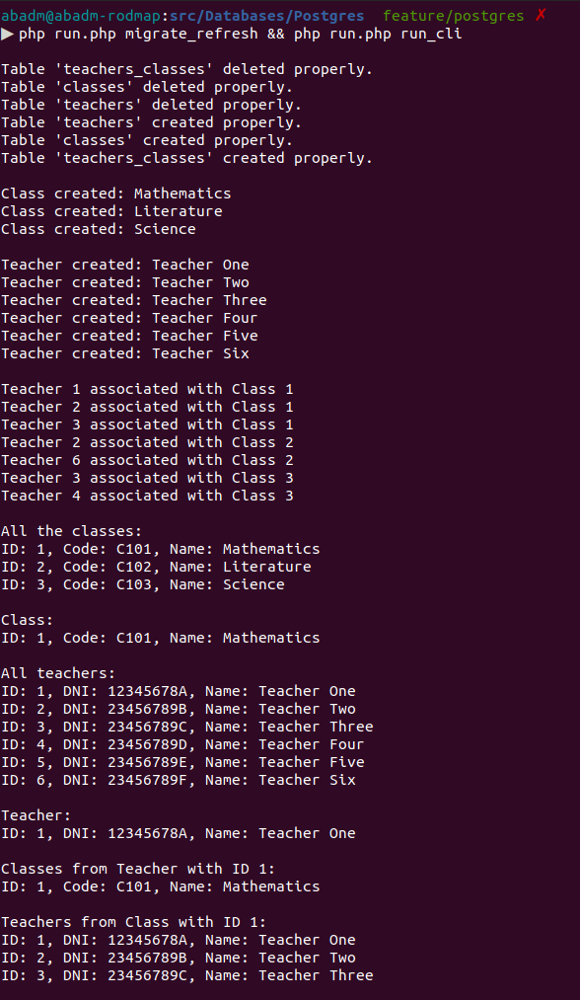

# Table of Contents
- [Introduction](#introduction)
- [Structure](#structure)
- [Instructions](#instructions)
- [Database Captures](#database-captures)
- [Database Structure](#database-structure)
- [Database Captures](#database-captures)
- [Execution](#execution)
- [Bibliography](#bibliography)

# Introduction

This modest project is developed using PHP 8.2, enabling the author to review and demonstrate their knowledge of PHP and PostgreSQL. It is not meant to serve as a guide or a manual for best practices.

The project is designed to include an implementation of a PostgreSQL database utilizing raw PHP.

Additionally, this project is a component of a PHP roadmap, which is in turn part of a series of such roadmaps. The PHP Roadmap can be accessed at the following URL:
- [Father](https://github.com/alexbonavila/PhpRoadmap)

# Structure

This project is designed to provide usable code within the 'Src' folder, containing all the necessary elements for integration into larger applications.

Additionally, the project features a small CLI (Command Line Interface) implementation, which serves to test the 'Src' code. This is located in the 'Cli' folder.

Lastly, the project includes a 'run.php' file which controls the execution.

# Instructions

This code have two commands:

The command below provides a wat to delete all the migrations, if these exist, and after that migrate again from fresh:

`$ php run.php migrate_refresh`

The next command executes the code in Cli folder, with the finality of test the PGSQL PHP structure created in Src:

`$ php run.php run_cli`

# Database Captures

# Database Structure

# Execution

# Bibliography
- https://www.php.net/manual/es/book.pgsql.php
- https://www.mssqltips.com/sqlservertip/3321/using-manytomany-relationships-in-multidimensional-sql-server-analysis-services/
- https://www.php.net/manual/es/ref.pgsql.php
- https://bipinparajuli.com.np/blog/many-to-many-relationship-in-postgresql
- https://stackoverflow.com/questions/9789736/how-to-implement-a-many-to-many-relationship-in-postgresql